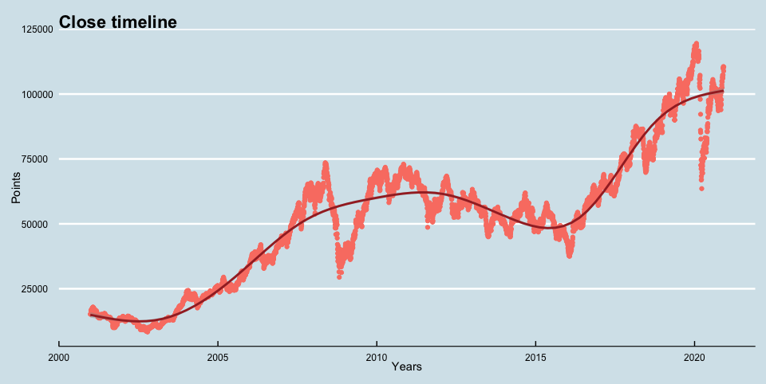

```{r setup, include = FALSE}
if(require(tidyverse)) library(tidyverse)
if(require(ggthemes)) library(ggthemes)
if(require(gridExtra)) library(gridExtra)
if(require(knitr)) library(knitr)
if(require(kableExtra)) library(kableExtra)
if(require(caret)) library(caret)
if(require(broom)) library(broom)
if(require(lubridate)) library(lubridate)
knitr::opts_chunk$set(echo = TRUE)

#loads the files created at code.R and tiding-data.R(available on GitHub)
td <- tempdir()
ibov <- tempfile(tmpdir = td, fileext = ".rda")
download.file("https://github.com/caerebello/ibovrange/raw/main/rdas/ibov.rda", ibov)
load(ibov) #data set
ibov2 <- tempfile(tmpdir = td, fileext = ".rda")
download.file("https://github.com/caerebello/ibovrange/raw/main/rdas/ibov2.rda", ibov2)
load(ibov2) #other format data set
ict <- tempfile(tmpdir = td, fileext = ".rda")
download.file("https://github.com/caerebello/ibovrange/raw/main/rdas/ict.rda", ict)
load(ict) #index composition total
results1 <- tempfile(tmpdir = td, fileext = ".rda")
download.file("https://github.com/caerebello/ibovrange/raw/main/rdas/results1.rda", results1)
load(results1) #results with 1 RMSE
results2 <- tempfile(tmpdir = td, fileext = ".rda")
download.file("https://github.com/caerebello/ibovrange/raw/main/rdas/results2.rda", results2)
load(results2) #results with 2 RMSE
#fits and accuracies
fit_glm_high <- tempfile(tmpdir = td, fileext = ".rda")
download.file("https://github.com/caerebello/ibovrange/raw/main/rdas/fit-glm-high.rda", fit_glm_high)
load(fit_glm_high)
fit_glm_low <- tempfile(tmpdir = td, fileext = ".rda")
download.file("https://github.com/caerebello/ibovrange/raw/main/rdas/fit-glm-low.rda", fit_glm_low)
load(fit_glm_low)
loess_high_accuracy <- tempfile(tmpdir = td, fileext = ".rda")
download.file("https://github.com/caerebello/ibovrange/raw/main/rdas/loess-high-accuracy.rda", loess_high_accuracy)
load(loess_high_accuracy)
loess_low_accuracy <- tempfile(tmpdir = td, fileext = ".rda")
download.file("https://github.com/caerebello/ibovrange/raw/main/rdas/loess-low-accuracy.rda", loess_low_accuracy)
load(loess_low_accuracy)
fit_loess_high <- tempfile(tmpdir = td, fileext = ".rda")
download.file("https://github.com/caerebello/ibovrange/raw/main/rdas/fit-loess-high.rda", fit_loess_high)
load(fit_loess_high)
fit_loess_low <- tempfile(tmpdir = td, fileext = ".rda")
download.file("https://github.com/caerebello/ibovrange/raw/main/rdas/fit-loess-low.rda", fit_loess_low)
load(fit_loess_low)
knn_high_accuracy <- tempfile(tmpdir = td, fileext = ".rda")
download.file("https://github.com/caerebello/ibovrange/raw/main/rdas/knn-high-accuracy.rda", knn_high_accuracy)
load(knn_high_accuracy)
knn_low_accuracy <- tempfile(tmpdir = td, fileext = ".rda")
download.file("https://github.com/caerebello/ibovrange/raw/main/rdas/knn-low-accuracy.rda", knn_low_accuracy)
load(knn_low_accuracy)
fit_knn_high <- tempfile(tmpdir = td, fileext = ".rda")
download.file("https://github.com/caerebello/ibovrange/raw/main/rdas/fit-knn-high.rda", fit_knn_high)
load(fit_knn_high)
fit_knn_low <- tempfile(tmpdir = td, fileext = ".rda")
download.file("https://github.com/caerebello/ibovrange/raw/main/rdas/fit-knn-low.rda", fit_knn_low)
load(fit_knn_low)
rf_low_accuracy <- tempfile(tmpdir = td, fileext = ".rda")
download.file("https://github.com/caerebello/ibovrange/raw/main/rdas/rf-low-accuracy.rda", rf_low_accuracy)
load(rf_low_accuracy)
rf_high_accuracy <- tempfile(tmpdir = td, fileext = ".rda")
download.file("https://github.com/caerebello/ibovrange/raw/main/rdas/rf-high-accuracy.rda", rf_high_accuracy)
load(rf_high_accuracy)
fit_rf_high <- tempfile(tmpdir = td, fileext = ".rda")
download.file("https://github.com/caerebello/ibovrange/raw/main/rdas/fit-rf-high.rda", fit_rf_high)
load(fit_rf_high)
fit_rf_low <- tempfile(tmpdir = td, fileext = ".rda")
download.file("https://github.com/caerebello/ibovrange/raw/main/rdas/fit-rf-low.rda", fit_rf_low)
load(fit_rf_low)
unlink(td)
rm(td)
#select 20 biggest companies at Ibovespa
ic <- ict %>% slice(1:20)

#colors for plots
color1 <- "#FA8072"
color2 <- "#FFE0E0"
color3 <- "#A52A2A"
```

\newpage

# 1 Executive Summary

This project deals with a behavioral assessment of Ibovespa, that is the São Paulo Stock Exchange Index. It is a theoretical stock portfolio that contains the assets that drive the highest trading volumes, something around 80% of daily total and is considered the benchmark for variable income.

To this end, several internal and global indicators were used, such as interest, foreign exchange, commodities, other markets and more.

The objective here is to train a machine learning algorithm that makes predictions of the Ibovespa daily high and low. The goal is an accuracy greater than 80% of the values with a 95% reliability and, for future, to develop strategies to operate in this market.

## 1.1 Data Set

The ibov dataset was compiled by me according to the needs of the project. The information used is available on the website of B3, the company that manages the stock exchange, on the investing.com platform and on BCB website (Central Bank of Brazil) using IBGE (Brazilian Institute of Geography and Statistics), FGV (Getúlio Vargars Foundation), CNI (Nacional Confederation of Industry) and Fecomercio (São Paulo State Commerce Federation) as a source. At the end of report, links will be available.

The first step was to observe the index 's companies and understand their weight. Below we can see that, with a total of `r nrow(ict)` companies, the top 20 represent `r max(ic$accum)*100`% of total. 

```{r ibovespa composition, echo=FALSE}
#shows the table
kable(ic) %>% kable_styling(bootstrap_options = "bordered", position = "center") %>% row_spec(20, color = "white", background = color1)
```

Analyzing these 20 companies closely, 4 are banks, a holding company with a large participation in the banking sector, in addition to B3 itself. We have 8 exporting companies, or with activities in other countries and, 6 retail companies or dependent on the domestic market. 

Based on these characteristics, the following were chosen as predictors:

* DI - interbank deposit (interest rate resulting from negotiations between banks).
* SLEIC - basic interest rate determined by the BCB.
* Exchange rate between USD / BRL and EUR / BRL
* Economic performance indicators:
  * IECI - Industrial Entrepreneur Confidence Index,
  * CCI - Consumer Confidence Index, 
  * IPCA & IGPM - price inflation indices. Columns were created with accumulated indexes.
  * Industry Activity Index and
  * Unemployment rate.

As Ibovespa's largest company, with a `r min(ic$accum)*100`% stake, is a big iron ore exporter, TIOc1 values (future iron market) is in dataset. In addition, 2 of the top 6 shares represent Petrobras, an oil company, so WTI values (future oil market) was also collected to try to explain the São Paulo stock index behavior.

Investors are globalized and B3 receives investments from all over the world. I understood that it is important to compare the Ibovespa movement with the main stock exchanges in the world. those used in the study were:

* Nasdaq - US
* S&P 500 - US
* Dow-Jones - US
* DAX - Germany
* Euronext - Netherlands / France
* LSE - UK
* Nikkei - Japan
* SSE - China

Investors control their risk and always look for a safe place for money. Thus, FED bonds are coveted and any change in their rate affects the world market. Is therefore in the dataset, besides, of course, Ibovespa historical series with open, close, high, low, volume traded and variation in percentage.

We also have the operations dates that are spread over:

* Year,
* Month,
* Month day,
* Week day and
* Quarter

Let's see how the data is arranged.

```{r ibov overview, echo = FALSE}
#shows ibov data format
ibov_slice <- ibov %>% slice(1000)
kable(ibov_slice[,1:9]) %>% kable_styling(bootstrap_options = "bordered", position = "center")
kable(ibov_slice[,10:18]) %>% kable_styling(bootstrap_options = "bordered", position = "center")
kable(ibov_slice[,19:27]) %>% kable_styling(bootstrap_options = "bordered", position = "center")
kable(ibov_slice[,28:35]) %>% kable_styling(bootstrap_options = "bordered", position = "center")
```

It contains `r ncol(ibov)` variables, high and low, that are the target of our predictions and others `r ncol(ibov)-2` predictors. Each line represents a market day. We have `r format (nrow(ibov), big.mark = ",")` lines in total, starting on `r min(ibov$date)` and ending on `r max(ibov$date)`.

The dataset contains several NAs due to the dates when one market is open and the other is not, for more recent data that have not yet been made available for some predictors and indicators or markets that haven't existed for so long.

Looking at a summary of the data, note that there are actually many NAs.

```{r ibov summary, echo = FALSE}
#shows ibov summary
si <- summary(ibov)
kable(si[,1:6]) %>% kable_styling(bootstrap_options = "bordered", position = "center")
kable(si[,7:12]) %>% kable_styling(bootstrap_options = "bordered", position = "center")
kable(si[,13:18]) %>% kable_styling(bootstrap_options = "bordered", position = "center")
kable(si[,19:24]) %>% kable_styling(bootstrap_options = "bordered", position = "center")
kable(si[,25:30]) %>% kable_styling(bootstrap_options = "bordered", position = "center")
kable(si[,31:35]) %>% kable_styling(bootstrap_options = "bordered", position = "center")
```
To develop the algorithm and define the parameters that maximize our results, cross validation was used, so ibov was divided into train_set, with 90%, and test_set, with 10% of observations and, train set was divided into train_set2, with 90%, and test_set2, with 10% of observations.

The data were analyzed from seasonality and between Ibovespa and predictors relationship point of view. Some of them were selected for predictions where logistic and local weighted regressions were used, in addition to k-nearest neighbors and random forest. The last two had a better result compared to the first.

\newpage

# 2 Methods and Analysis

The first step was to observe the distribution of Ibovespa points and, as expected, open, close, high and low have the same density curve.

```{r points distribution, echo = FALSE, results = "hide", fig.align = 'center'}
#makes the plots  
p1 <- ibov %>% ggplot (aes (low, fill = color1)) + geom_density (color = "black") + theme_economist () + xlab ("") + ylab ("Count") + ggtitle ("Low distribution") + theme (axis.text.x = element_text (size = 0), axis.text.y = element_text (size = 9)) + scale_x_continuous(breaks=seq(0, 125000, by = 25000)) + guides(fill=FALSE)

p2 <- ibov %>% ggplot (aes (high, fill = color1)) + geom_density (color = "black") + theme_economist () + xlab ("") + ylab ("") + ggtitle ("High distribution") + theme (axis.text.x = element_text (size = 0), axis.text.y = element_text (size = 0)) + guides(fill=FALSE)

p3 <- ibov %>% ggplot (aes (open, fill = color1)) + geom_density (color = "black") + theme_economist () + xlab ("Points") + ylab ("Count") + ggtitle ("Open distribution") + theme (axis.text.x = element_text (size = 9), axis.text.y = element_text (size = 9)) + guides(fill=FALSE)

p4 <- ibov %>% ggplot (aes (close, fill = color1)) + geom_density (color = "black") + theme_economist () + xlab ("Points") + ylab ("") + ggtitle ("Close distribution") + theme (axis.text.x = element_text (size = 9), axis.text.y = element_text (size = 0)) + guides(fill=FALSE)

grid.arrange(p1, p2, p3, p4, ncol = 2, nrow = 2)
```

```{r, echo = FALSE, fig.align = 'center'}
#shows saved plot
#
```

The first thing catches our attention is we have 3 peaks, as 3 distinct approximately normal distributions. To try to understand this phenomenon we will observe Ibovespa development overtime using closing numbers.

```{r ibov timeline, echo = FALSE, results = "hide", fig.align = 'center'}
#makes the plot  
ibov %>% ggplot (aes (date, close)) + geom_point(color = color1) + geom_smooth(color = color3) + theme_economist () + xlab ("Years") + ylab ("Points") + ggtitle ("Close timeline") + theme (axis.text.x = element_text (size = 9), axis.text.y = element_text (size = 9)) + guides(fill=FALSE)
```

```{r, echo = FALSE, fig.align = 'center'}
#shows saved plot
#
```

We can clearly see that the index remained at 3 levels: Below 25 thousand points in the 2000s, close to 70 thousand points in the 2010s and in 2020 it reached the level of 100 thousand points. This explains the 3 humps in the data distribution. We can see a major depression in 2008, due to the financial crisis, another around 2016/17, when President Dilma Rousseff's had impeachmeant and, after a good recovery, another depression in 2020 with COVID-19 pandemic.

Observing the timeline of the 4 Ibovespa points columns:

```{r ibovespa timeline, echo = FALSE, results = "hide", fig.align = 'center'}
#makes the plot  
ibov %>% group_by(year) %>% summarise(close = mean(close), open = mean(open), high = mean(high), low = mean(low)) %>% ggplot (aes (year, close)) + geom_line(color = color1) + geom_line(aes (year, open), color = color2) + geom_line(aes (year, high), color = color3) + geom_line(aes (year, low), color = color3) + theme_economist () + xlab ("Years") + ylab ("Points") + ggtitle ("Ibovespa year average timeline") + theme (axis.text.x = element_text (size = 9), axis.text.y = element_text (size = 9))
```

```{r, echo = FALSE, fig.align = 'center'}
#shows saved plot
#
```

We can see the difference between high and low is small in the 2000s and the market suffered greater volatility in years around 2008. It falls and, between 2010 and 2016, rises again. Starts to decrease and now, between 2019 and 2020 it has increased again. We can see when markets are rising, volatility drops and, when they are falling, with crises, the variance increases. Opening and closing is always near and obviously between high and low.

\newpage

## 2.1 Volume Effect

The volume of money can be expected to directly affect the value of assets. But in what way? First, let's see how the data is distributed.

```{r volume distribution, echo = FALSE, warning = FALSE, results = "hide", fig.align = 'center'}
#makes the plot  
ibov %>% ggplot (aes (volM, fill = color1)) + geom_histogram (bins = 30, color = "black") + scale_x_log10() + theme_economist () + xlab ("Log scaled volume in millions") + ylab ("Count") + ggtitle ("Volume distribution") + theme (axis.text.x = element_text (size = 9), axis.text.y = element_text (size = 9)) + guides(fill=FALSE)
```

```{r, echo = FALSE, fig.align = 'center'}
#shows saved plot
#
```

We now have two humps, different from what we saw with the stock index. Let's look at timeline.

```{r volume timeline, echo = FALSE, warning = FALSE, results = "hide", fig.align = 'center'}
#makes the plots  
p5 <- ibov %>% ggplot (aes (date, volM)) + geom_point(color = color1) + geom_smooth(color = color3) + scale_y_log10() + theme_economist () + xlab ("Years") + ylab ("Log scaled volume") + ggtitle ("Volume timeline") + theme (axis.text.x = element_text (size = 9), axis.text.y = element_text (size = 9)) + guides(fill=FALSE)

p6 <- ibov %>% ggplot (aes (date, volM)) + geom_point(color = color1) + geom_smooth(color = color3) + theme_economist () + xlab ("Years") + ylab ("Volume") + ggtitle ("") + theme (axis.text.x = element_text (size = 9), axis.text.y = element_text (size = 9)) + guides(fill=FALSE)

grid.arrange(p5, p6, ncol = 2)
```

```{r, echo = FALSE, fig.align = 'center'}
#shows saved plot
#
```

We realized that the financial volume of operations was very high and, in mid-2008 it plummeted. On the logarithmic scale chart we notice that the volume shows a reaction, but with normal scale we can see that compared to the pre 2008 phase, the trading volume remains practically dead.

Looking at plot, the relation between volume and index score seems obvious an inverse relation. 

```{r close per volume, echo = FALSE, , warning = FALSE, results = "hide", fig.align = 'center'}
#makes the plot  
ibov %>% ggplot (aes (volM, close)) + geom_point(color = color1) + geom_smooth(span = 0.9, color = color3) + theme_economist () + xlab ("Scaled Volume") + ylab ("Scaled Close") + ggtitle ("Close per volume") + theme (axis.text.x = element_text (size = 9), axis.text.y = element_text (size = 9)) + scale_y_log10() + scale_x_log10() +guides(fill=FALSE)
```

```{r, echo = FALSE, fig.align = 'center'}
#shows saved plot
#include_graphics("figs/close-per-volume.png")
```

```{r ibov vol, include = FALSE}
#filters ibov by volume and decade
ibov_vol <- ibov %>% filter(!is.na(volM))
ibov_vol_0010 <- ibov_vol %>% filter(year <= 2010 & year >= 2000)
ibov_vol_1020 <- ibov_vol %>% filter(year >= 2010)
```

The lower the volume, the higher the price index. But does it make any sense? Shouldn't the larger financial volume show a more euphoric market with rising prices? The market may be euphoric to sell as well, so in 2 moments this correlation is reversed. The correlation between index and volume is `r round(cor(ibov_vol$close, ibov_vol$volM),2)`, but between 2000 and 2010 is `r round(cor(ibov_vol_0010$close, ibov_vol_0010$volM),2)` and, between 2010 and 2020, `r round(cor(ibov_vol_1020$close, ibov_vol_1020$volM),2)`. However, in this case the historical maxims without volume draw attention.

## 2.2 Seasonality Effect

The financial market has a recurring schedule. There are dividend distribution, contracts that expire every month, often on the same day, others with expirations linked to week day, others are quarterly and this movement can influence prices. Another relevant factor is the routines within the institutions, with goals and targets often weekly. In addition, we have the annual seasonality of the market with its cycles of commodities, taxes and others.

We have seen that over the years the index has varied between a minimum of `r format(min(ibov$low), big.mark = ",")` and a maximum of `r format(max(ibov$high), big.mark = ",")` points. `r round(max(ibov$high)/min(ibov$low), 1)` times the minimum. This makes it very difficult to perceive the effect of seasonality. As this variation is well explained by time, loess was used to minimize the variation in value over the years.

### 2.2.1 Local weighted regression (loess)

To smooth the line over the years, local weighted regression (loess) was used, which allows us to consider different sizes of data windows using Taylor's theorem, which tells us that if you look closely at any smooth function $f(x)$, it will look like a line. We can consider larger window sizes with the linear assumption than with a constant. For each point $x0$ loess defines a window and fits a line within that window ($h$).

$$ E[Y_i  \mid  X_i = x_i] = \beta_0 + \beta_1(x_i-x_0)\ \ if\ \mid x_i - x_0 \mid \leq h $$

The value adjusted at $x0$ becomes our estimate $\hat{f}(x0)$. The final result is a smoother fit, as we use larger sample sizes to estimate our local parameters. Loess maintains the same number of points used in the local adjustment, which is controlled by the span argument that expects the proportion of the total data. Instead of using least squares, we minimize a weighted version:

$$ \sum_{i=1}^{N} w_0(x_i)[Y_i - \{\beta_0 + \beta_1 (x_i - x_0)\}]^2 $$

Instead of the Gaussian kernel, loess uses a function called Tukey's triple weight that reaches the values closer to the maximum.

$$ W(u) = \big(1 - \mid u \mid ^3\big)^3\ \ if\ \mid u \mid \leq 1\ \ and\ \ W(u) = 0\ \ if\ \mid u \mid > 1 $$
$$ w_0(x_i) = W\bigg(\frac{x_i - x_0}{h}\bigg) $$

Taylor's theorem tells us if we don't look so closely at the mathematical function, it looks like a parable. This is the standard function procedure and can be adjusted through the degree parameter, being 1 to adjust polynomials of degree 1 (lines) and 2 for parabolas. To smooth the Ibovespa close scores over the years, degree 1 and span 0.1 were used.

The line generated by loess $l$ was subtracted from the closing value $c$ on the same date $d$ forming Center Close $CC$ with average 0.

$$ CC_d = c_d - l_d $$
```{r loess results, include = FALSE}
#makes loess regression line
fit_ibv_time <- train(close ~ date, method = "gamLoess", tuneGrid = data.frame(degree = 1, span = 0.1), data = ibov)
```
```{r print loess results, echo = FALSE}
fit_ibv_time
```

\newpage

### 2.2.2 Over the year

To understand the index behavior, we'll analyze the distribution over the quarters and months.

```{r , echo = FALSE, results = "hide", include = FALSE}
#labels
ml <- data.frame(m_label = c("January", "February", "March", "April", "May", "June", "July", "August", "September", "October", "November", "December"), month = c(1:12)) # month(x, label = TRUE) didn't work.
ql <- data.frame(q_label = c("1st quarter", "2nd quarter", "3rd quarter", "4th quarter"), quarter = c(1:4))
wd <- data.frame(wd_label = c("Monday", "Tuesday", "Wednesday", "Thursday", "Friday"), week_day = c(2:6)) #weekdays(date) returns in Portuguese.
#makes centered values
pred_ibv_time <- predict(fit_ibv_time, newdata = ibov)
ibv_time <- ibov %>% mutate(center_ibv = close - pred_ibv_time) %>% left_join(ml, by = "month") %>% left_join(ql, by = "quarter") %>% left_join(wd, by = "week_day")
#quarters distribution
quarter_dist <- ibv_time  %>% group_by(quarter) %>% summarise(center_ibv = center_ibv, avg = mean(center_ibv), sd = sd(center_ibv), q_label = q_label) %>% mutate(q_label = reorder(q_label, quarter))
#months distribution
months_dist <- ibv_time  %>% group_by(month) %>% summarise(center_ibv = center_ibv, avg = mean(center_ibv), sd = sd(center_ibv), m_label = m_label) %>% mutate(m_label = reorder(m_label, month))
#month days distribution
days_dist <- ibv_time  %>% mutate(month_day_l = as.character(month_day)) %>% group_by(month_day) %>% summarise(center_ibv = center_ibv, avg = mean(center_ibv), sd = sd(center_ibv), month_day_l = month_day_l) %>% mutate(month_day_l = reorder(month_day_l, month_day))
da <- days_dist %>% group_by(month_day) %>% summarise(avg = avg[1]) %>% arrange(desc(avg))
#week days distribution
wdays_dist <- ibv_time %>% group_by(week_day) %>% summarise(center_ibv = center_ibv, avg = mean(center_ibv), sd = sd(center_ibv), wd_label = wd_label) %>% mutate(wd_label = reorder(wd_label, week_day))
wda <- wdays_dist %>% group_by(week_day) %>% summarise(avg = avg[1], sd = sd[1]) %>% arrange(desc(avg))
```

```{r quarters & months distributions, echo = FALSE, warning = FALSE, results = "hide", fig.align = 'center'}
#makes the plot
p7 <- quarter_dist %>% ggplot(aes(q_label, center_ibv, group = quarter, fill = q_label)) + geom_boxplot() + geom_point(aes(q_label, avg))  + theme_economist() + theme(axis.text.x = element_text(angle = 90, hjust = 1, size = 9), axis.text.y = element_text(hjust = 1, size = 9)) + xlab("") + ylab("Points") + ggtitle("Quarters distributions") + guides(fill=FALSE)

p8 <- months_dist %>% ggplot(aes(m_label, avg, ymin = avg - sd, ymax = avg + sd)) + geom_point(color = "black") + geom_errorbar(aes(color = m_label)) + theme_economist() + theme(axis.text.x = element_text(angle = 90, hjust = 1, size = 9), axis.text.y = element_text(hjust = 1, size = 9), legend.position = "none") + xlab("") + ylab("Points") + ggtitle("Months error (1SD)")

grid.arrange(p7, p8, nrow = 2)
```

```{r, echo = FALSE, fig.align = 'center'}
#shows saved plots
#
```

Looking at the plots, we can see the average and median are very close, in addition to the first and third quartiles, which are not very far apart. Usually between May and August we have a low moment, with the lowest average in June. January and February are the peak months. We can also see a cycle of variance, the smallest in August and continues to increase until its peak in March, when it returns to retract.

\newpage

### 2.2.3 Over the month

With the intention of finding days that every month behave similarly, let's look at the data.

```{r month days dist & error, echo = FALSE, , warning = FALSE, results = "hide", fig.align = 'center'}
#makes the plot  
p9 <- days_dist %>% ggplot(aes(month_day_l, center_ibv, group = month_day_l, fill = month_day_l)) + geom_boxplot() + geom_point(aes(month_day_l, avg))  + theme_economist() + theme(axis.text.x = element_text(hjust = 1, size = 9), axis.text.y = element_text(hjust = 1, size = 9)) + xlab("") + ylab("Points") + ggtitle("Month days distributions") + guides(fill=FALSE)

p10 <- days_dist %>% ggplot(aes(month_day_l, avg)) + geom_point(aes(color = month_day_l, size = sd)) + geom_smooth(aes(month_day, avg), color = color3) + theme_economist() + theme(axis.text.x = element_text(hjust = 1, size = 9), axis.text.y = element_text(hjust = 1, size = 9), legend.position = "none") + xlab("") + ylab("Points") + ggtitle("Month days error (1SD)") + ggtitle("Month days average", subtitle = "Size is standar deviation")

grid.arrange(p9, p10, nrow = 2)
```

```{r, echo = FALSE, fig.align = 'center'}
#shows saved plot
#include_graphics("figs/month-days.png")
```

We can see every day is well distributed, with 50% of the data are relatively close to the average and the median. Looking at the means closely, we notice the first month days tend to be more valued than the last ones, with major depressions around the 14th and 17th. `r round(da[1,1])` and `r round(da[2,1])`  are the top ones above the average, `r round(da[1,2])` and `r round(da[2,2])` points respectively. The worst scores are those of days `r round(da[31,1])` and `r round(da[30,1])` with `r round(da[31,2] * - 1)` and `r round(da[30,2] * - 1)` points below average. The difference between the most positive and most negative days average is `r round(da [1,2] - da [31,2])` points.

\newpage

### 2.2.4 Week days effect

As previously mentioned, financial institutions that operate on the stock exchange have weekly routines, in addition to contracts that have their maturities linked to week day. So let's look for patterns that can help us with predictions.

```{r week days dist & error, echo = FALSE, warning = FALSE, results = "hide", fig.align = 'center'}
#makes the plot  
p11 <- wdays_dist %>% ggplot(aes(wd_label, center_ibv, group = wd_label, fill = wd_label)) + geom_boxplot() + geom_point(aes(wd_label, avg))  + theme_economist() + theme(axis.text.x = element_text(angle = 90, hjust = 1, size = 9), axis.text.y = element_text(hjust = 1, size = 9)) + xlab("") + ylab("Points") + ggtitle("Week days distributions") + guides(fill=FALSE)

p12 <- wdays_dist %>% ggplot(aes(wd_label, avg)) + geom_point(aes(color = wd_label, size = sd)) + theme_economist() + theme(axis.text.x = element_text(angle = 90, hjust = 1, size = 9), axis.text.y = element_text(hjust = 1, size = 9), legend.position = "none") + xlab("") + ylab("Points") + ggtitle("Month days error (1SD)") + ggtitle("Week days average", subtitle = "Size is standar deviation")

grid.arrange(p11, p12, ncol = 2)
```

```{r, echo = FALSE, fig.align = 'center'}
#shows saved plot
#
```

We can see the week days are well distributed and, looking at the means closely, we can see a linear rise from Monday to Friday. Between Monday and Friday the average difference is `r round(wda[1,2] - wda[5,2])` points. Tuesday has the smallest standard deviation, `r format(round(min(wda$sd)), big.mark = ",")` while Monday the biggest, `r format(round(max(wda$sd)), big.mark = ",")`, only `r round((max(wda$sd)/min(wda$sd)-1)*100, 2)`% bigger.

\newpage

## 2.3 Markets Around the World

Large investment funds move billions of dollars daily across the world according to events. We will analyze the movements of the main world exchanges in comparison to São Paulo. As each index has its score, the values have been scaled.

```{r ibovespa x world, echo = FALSE, results = "hide", fig.align = 'center', warning = FALSE}
#makes the plots
ibov2$type <- ifelse(ibov2$type == "Nasdaq", "Others", ibov2$type)

p13 <- ibov2 %>% filter(type == "Ibovespa" | type == "Others") %>% ggplot(aes(date, value, color = type)) + geom_line() + theme_economist() + theme(axis.text.x = element_text(size = 9), axis.text.y = element_text(size = 9)) + xlab("") + ylab("") + ggtitle("Ibovespa x Nasdaq") + labs(color = "") + scale_color_manual(values = c(color1, color3)) 

p14 <- ibov2 %>% filter(type == "Ibovespa" | type == "Dow-Jones") %>% ggplot(aes(date, value, color = type)) + geom_line() + theme_economist() + theme(axis.text.x = element_text(size = 9), axis.text.y = element_text(size = 9), legend.position="none") + xlab("") + ylab("") + ggtitle("Ibovespa x Dow-Jones") + labs(color = "") + scale_color_manual(values = c(color3, color1))

p15 <- ibov2 %>% filter(type == "Ibovespa" | type == "S&P 500") %>% ggplot(aes(date, value, color = type)) + geom_line() + theme_economist() + theme(axis.text.x = element_text(size = 9), axis.text.y = element_text(size = 9), legend.position="none") + xlab("") + ylab("") + ggtitle("Ibovespa x S&P 500") + labs(color = "") + scale_color_manual(values = c(color1, color3))

p16 <- ibov2 %>% filter(type == "Ibovespa" | type == "DAX") %>% ggplot(aes(date, value, color = type)) + geom_line() + theme_economist() + theme(axis.text.x = element_text(size = 9), axis.text.y = element_text(size = 9), legend.position="none") + xlab("") + ylab("") + ggtitle("Ibovespa x DAX") + labs(color = "") + scale_color_manual(values = c(color3, color1))

p17 <- ibov2 %>% filter(type == "Ibovespa" | type == "LSE") %>% ggplot(aes(date, value, color = type)) + geom_line() + theme_economist() + theme(axis.text.x = element_text(size = 9), axis.text.y = element_text(size = 9), legend.position="none") + xlab("") + ylab("") + ggtitle("Ibovespa x LSE") + labs(color = "") + scale_color_manual(values = c(color1, color3))

p18 <- ibov2 %>% filter(type == "Ibovespa" | type == "Euronext") %>% ggplot(aes(date, value, color = type)) + geom_line() + theme_economist() + theme(axis.text.x = element_text(size = 9), axis.text.y = element_text(size = 9), legend.position="none") + xlab("") + ylab("") + ggtitle("Ibovespa x Euronext") + labs(color = "") + scale_color_manual(values = c(color3, color1))

p19 <- ibov2 %>% filter(type == "Ibovespa" | type == "Nikkei") %>% ggplot(aes(date, value, color = type)) + geom_line() + theme_economist() + theme(axis.text.x = element_text(size = 9), axis.text.y = element_text(size = 9), legend.position="none") + xlab("") + ylab("") + ggtitle("Ibovespa x Nikkei") + labs(color = "") + scale_color_manual(values = c(color1, color3))

p20 <- ibov2 %>% filter(type == "Ibovespa" | type == "SSE") %>% ggplot(aes(date, value, color = type)) + geom_line() + theme_economist() + theme(axis.text.x = element_text(size = 9), axis.text.y = element_text(size = 9), legend.position="none") + xlab("") + ylab("") + ggtitle("Ibovespa x SSE") + labs(color = "") + scale_color_manual(values = c(color1, color3))

grid.arrange(p13, p14, p15, p19, p16, p17, p18, p20, ncol = 4, nrow = 2)
```

```{r, echo = FALSE, fig.align = 'center'}
#shows saved plot
#include_graphics("figs/ibovespa-x-world.png")
```

We note that all exchanges come from a depression after the fall of the twin towers in September 2001. The European ones had more severe crashes and have a good recovery, when in 2008, all markets plummeted, especially Euronext. While DAX had a recovery more like the Dow-Jones and S&P 500, Nasdaq and LSE had an almost exponential recovery.

```{r exchange correlations, include = FALSE}
#makes the table
cors <- data.frame(Exchange = c("Nasdaq", "Dow Jones", "S&P 500", "DAX", "LSE", "Euronext", "Nikkei", "SSE"), Correlation = c(round(as.numeric(ibov %>% filter(!is.na(nasdaq)) %>% summarise(cor(close, nasdaq))), 2), round(as.numeric(ibov %>% filter(!is.na(dj)) %>% summarise(cor(close, dj))), 2), round(as.numeric(ibov %>% filter(!is.na(sp500)) %>% summarise(cor(close, sp500))), 2), round(as.numeric(ibov %>% filter(!is.na(dax)) %>% summarise(cor(close, dax))), 2), round(as.numeric(ibov %>% filter(!is.na(lse)) %>% summarise(cor(close, lse))), 2), round(as.numeric(ibov %>% filter(!is.na(euronext)) %>% summarise(cor(close, euronext))), 2), round(as.numeric(ibov %>% filter(!is.na(nikkei)) %>% summarise(cor(close, nikkei))), 2), round(as.numeric(ibov %>% filter(!is.na(sse)) %>% summarise(cor(close, sse))), 2)))
```

```{r correlations table, echo=FALSE}
#shows the table
kable(cors) %>% kable_styling(bootstrap_options = "bordered", position = "center") %>% row_spec(2, color = "white", background = color1)
```

We can see al exchanges around the world are highly correlated and, the greatest correlation is with the Dow Jones index, but all others scores almost the same, with the exception of SSE and Euronext slightly below.

\newpage

### 2.3.1 FED Bonds

As previously stated, US Treasury bills are considered to be the safest investment and attracts investors, so we are going to observe the Ibovespa variation compared to changes in FED rates.

```{r fed plot, echo = FALSE, results = "hide", fig.align = 'center', warning = FALSE}
#makes the plots
p21 <- ibov2 %>% filter(type == "Ibovespa" | type == "FED Rate") %>% ggplot(aes(date, value, color = type)) + geom_line() + theme_economist() + theme(axis.text.x = element_text(size = 9), axis.text.y = element_text(size = 9)) + xlab("") + ylab("") + ggtitle("Ibovespa x Industry Activity") + labs(color = "") + scale_color_manual(values = c(color1, color3)) 

p22 <- ibov %>% ggplot(aes(fed_rate, close)) + geom_point(color = color1) + theme_economist() + theme(axis.text.x = element_text(size = 9), axis.text.y = element_text(size = 9)) + xlab("FED rate") + ylab("Points") + ggtitle("") + geom_smooth(color = color3)

grid.arrange(p21, p22, ncol = 2)
```

```{r, echo = FALSE, fig.align = 'center'}
#shows saved plot
#
```

```{r fed correlation, include = FALSE}
cor_fed <- round(as.numeric(ibov %>% filter(!is.na(fed_rate)) %>% summarise(cor(close, fed_rate))), 2) #ibov / fed correlation
```

The correlation between Ibovespa and the FED rate is `r cor_fed`, it really seems difficult to see many relationships between the movement of the two lines, if not for the fact that the FED seems to anticipate the big falls. Despite the zigzag, the correlation is clearly negative.  

## 2.4 Local Economy

As, theoretically, the stock exchange is a portrait of main companies in the country, it should be affected by the local economic activity. Let's start with industrial activity, as among the 20 largest we have 8 industries. This data came from IBGE. 

As the market lives on expectations, we will use the IECI, the industrial entrepreneur confidence index, to help us understand the relationship between the expectations of entrepreneurs and the movement of the stock exchange. It came from CNI opinion polls.

Of the 20 main companies, 11 depend significantly on local retail, which obviously also influences industrial production, so let's assess the correlation between Ibovespa and the CCI, consumer confidence index. That information came from Fecomercio opinion polls.

As the basis of all this is people's income, let's look at the performance of stock exchange compared to unemployment rate. All values were scaled to facilitate comparison.

```{r economy indicators, echo = FALSE, results = "hide", fig.align = 'center', warning = FALSE}
#makes the plots
ibov2$type <- ifelse(ibov2$type == "Industry Activity", "Others", ibov2$type)

p23 <- ibov2 %>% filter(type == "Ibovespa" | type == "Others") %>% ggplot(aes(date, value, color = type)) + geom_line() + theme_economist() + theme(axis.text.x = element_text(size = 9), axis.text.y = element_text(size = 9)) + xlab("") + ylab("") + ggtitle("Ibovespa x Industry Activity") + labs(color = "") + scale_color_manual(values = c(color1, color3)) 

p24 <- ibov2 %>% filter(type == "Ibovespa" | type == "IECI") %>% ggplot(aes(date, value, color = type)) + geom_line() + theme_economist() + theme(axis.text.x = element_text(size = 9), axis.text.y = element_text(size = 9), legend.position="none") + xlab("") + ylab("") + ggtitle("Ibovespa x IECI") + labs(color = "") + scale_color_manual(values = c(color1, color3)) 

p25 <- ibov2 %>% filter(type == "Ibovespa" | type == "CCI") %>% ggplot(aes(date, value, color = type)) + geom_line() + theme_economist() + theme(axis.text.x = element_text(size = 9), axis.text.y = element_text(size = 9), legend.position="none") + xlab("") + ylab("") + ggtitle("Ibovespa x CCI") + labs(color = "") + scale_color_manual(values = c(color3, color1))

p26 <- ibov2 %>% filter(type == "Ibovespa" | type == "Unemployment") %>% ggplot(aes(date, value, color = type)) + geom_line() + theme_economist() + theme(axis.text.x = element_text(size = 9), axis.text.y = element_text(size = 9), legend.position="none") + xlab("") + ylab("") + ggtitle("Ibovespa x Unemployment") + labs(color = "") + scale_color_manual(values = c(color1, color3)) 

ibov2$type <- ifelse(ibov2$type == "Others", "Industry Activity", ibov2$type) #for title

grid.arrange(p23, p24, p25, p26, nrow = 2, ncol = 2)
```

```{r, echo = FALSE, fig.align = 'center'}
#shows saved plot
#
```

```{r economy indicators correlations, include = FALSE}
#makes the table
cors2 <- data.frame(Indicator = c("Industry Activity", "IECI", "CCI", "Unemployment"), Correlation = c(round(as.numeric(ibov %>% filter(!is.na(industry_activity)) %>% summarise(cor(close, industry_activity))), 2), round(as.numeric(ibov %>% filter(!is.na(ieci)) %>% summarise(cor(close, ieci))), 2), round(as.numeric(ibov %>% filter(!is.na(cci)) %>% summarise(cor(close, cci))), 2), round(as.numeric(ibov %>% filter(!is.na(unemployment)) %>% summarise(cor(close, unemployment))), 2)))
```

Industrial activity seems to follow the Ibovespa but with a delay and more volatility. After 2015, it was stagnant below average while the stock index soared upward, acting homogeneously in the pandemic. The correlation between them is `r cors2[1,2]`, negative and low.

The businessmen mood was glued to the stock market's performance when, with a rapid recovery after 2008, confidence surpassed the market, but when show itself weak, the discouragement was much greater than Ibovespa fall. Even with the index rising sharply in recent years, the mood of businessmen has not kept up with the same intensity, in oposit, with the pandemic it fell to historic low, but recovering at the same speed. The correlation between them is `r cors2[2,2]`, positive, but not strong.

With a correlation of `r cors2[3,2]`, consumer confidence seemed overestimated before 2013, when the mood changed and seems underestimated until today compared to Ibovespa.

Between 2000 and 2015, the unemployment rate was negatively correlated with market performance, as expected. However, from 2015 to today, inexplicably, unemployment and the value of shares are constantly growing together. Thus the total correlation in the period was `r cors2[4,2]`.

\newpage

### 2.4.1 Interest rates

The interest rate directly impacts the economy, as if too high it tends to discourage investments in production and consumption, if it is too low it can cause an exaggerated increase in credit, generating bubbles and inflation. In addition, 6 of the 20 largest companies in the index are banks or related to the sector.

We will analyze 2 rates, DI and SELIC. DI, interbank deposit, is a market rate and works as parameter for investments in fixed income. The SELIC, in turn, is the basic interest rate determined by BCB, it is its main monetary policy instrument to control inflation.

```{r ibovespa x di x selic, echo = FALSE, results = "hide", fig.align = 'center', warning = FALSE}
#makes the plots
p27 <- ibov %>% ggplot(aes(di, close)) + geom_point(color = color1) + theme_economist() + theme(axis.text.x = element_text(size = 9), axis.text.y = element_text(size = 9)) + xlab("DI") + ylab("Points") + geom_smooth(color = color3) + ggtitle("Ibovespa x DI")

p28 <- ibov %>% ggplot(aes(selic, close)) + geom_point(color = color1) + theme_economist() + theme(axis.text.x = element_text(size = 9), axis.text.y = element_text(size = 9)) + xlab("SELIC") + ylab("Points") + ggtitle("Ibovespa x SELIC") + geom_smooth(color = color3)

grid.arrange(p27, p28, ncol = 2)
```

```{r, echo = FALSE, fig.align = 'center'}
#shows saved plot
#
```

```{r interests correlations, include = FALSE}
#makes the table
cors_di_selic <- data.frame(Indicator = c("di", "selic", "di_selic"), Correlation = c(round(as.numeric(ibov %>% filter(!is.na(di)) %>% summarise(cor(close, di))), 2), round(as.numeric(ibov %>% filter(!is.na(selic)) %>% summarise(cor(close, selic))), 2), round(as.numeric(ibov %>% filter(!is.na(di) & !is.na(selic)) %>% summarise(cor(di, selic))), 2)))
```

We can see the two rates are totally correlated each other and, in relation to Ibovespa, both with negative correlation equal to `r cors_di_selic[1,2]*-1`.

\newpage

### 2.4.2 Price inflation indices

Inflation has many causes and consequences, it can be a sign of consumption or scarcity of goods, it can be related to an abundance of credit, an increase in amount of money in market, or to exchange rate, since Brazil imports a wide range of essential products.

Two different indices were selected for comparison.

* IPCA - Acronym in Portuguese for Extended National Consumer Price Index, is calculated by IBGE and is considered the official inflation index of country. The indicator serves as a reference for Central Bank to decide Selic, measures the prices of products and services charged to families living in metropolitan regions with monthly incomes of 1 to 40 minimum wages and, the following groups are researched: food and beverages, housing, residence, clothing, transport, health and personal care, personal expenses, education and communication.

* IGP-M - Acronym in Portuguese for General Price Index - Market, is calculated by FGV and checks wholesale prices, for the producer (60%), retail, for the consumer (30%) and in the construction sector (10%). The IGP-M is used to correct rent contracts and electricity supply prices.

```{r inflation correlations, include = FALSE}
#data for plots
cors_ipca_igpm <- data.frame(Indicator = c("ipca", "igpm", "ipca_igpm"), Correlation = c(round(as.numeric(ibov %>% filter(!is.na(ipca_acc)) %>% summarise(cor(close, ipca_acc))), 2), round(as.numeric(ibov %>% filter(!is.na(igpm_acc)) %>% summarise(cor(close, igpm_acc))), 2), round(as.numeric(ibov %>% filter(!is.na(igpm_acc) & !is.na(ipca_acc)) %>% summarise(cor(igpm_acc, ipca_acc))), 2)))
```

```{r inflation plot, echo = FALSE, results = "hide", fig.align = 'center', warning = FALSE}
#makes the plot
ibov2 %>% filter(date >= "2006-05-02") %>% group_by(type) %>% mutate(value = scale(value)) %>% ungroup() %>% filter(type == "Ibovespa" | type == "IGP-M" | type == "IPCA") %>% ggplot(aes(date, value, color = type)) + geom_line() + theme_economist() + theme(axis.text.x = element_text(size = 9), axis.text.y = element_text(size = 9)) + xlab("") + ylab("") + ggtitle("Ibovespa x IGP-M / IPCA") + labs(color = "") + scale_color_manual(values = c(color1, color3, "purple")) 
```

```{r, echo = FALSE, fig.align = 'center'}
#shows saved plot
#
```

It's easy to see that both accumulated inflation indexes are extremely correlated with each other, `r cors_ipca_igpm [3, 2]`, and very correlated with Ibovespa, `r cors_ipca_igpm [1, 2]` for IPCA and `r cors_ipca_igpm [2, 2] ` for IGP-M, the highest among all indicators. We can say the Ibovespa is only paying for price increase.

\newpage

## 2.5 Exchange Rate

At least half of the 20 largest companies on Ibovespa export, import or have representation in other countries. In addition, Brazil is dependent on imports of petroleum fuel, chemical fertilizers, products from manufacturing industry and telecommunications equipment. Until very recently, Brazil had attractive interest rates, which increased the inflow of foreign capital keeping  exchange rate controlled. This has been changing lately, let's see the impact of Euro and Dollar on Ibovespa.

```{r usd eur plot, echo = FALSE, results = "hide", fig.align = 'center', warning = FALSE}
#makes the plot
p29 <- ibov2 %>% filter(type == "Ibovespa" | type == "USD" | type == "EUR") %>% ggplot(aes(date, value, color = type)) + geom_line() + theme_economist() + theme(axis.text.x = element_text(size = 9), axis.text.y = element_text(size = 9)) + xlab("") + ylab("") + ggtitle("Ibovespa x USD / EUR") + labs(color = "") + scale_color_manual(values = c(color3, color1, "purple")) 

p30 <- ibov %>% ggplot(aes(usd, close)) + geom_point(color = color1) + theme_economist() + theme(axis.text.x = element_text(size = 9), axis.text.y = element_text(size = 9)) + xlab("USD") + ylab("Points") + ggtitle("Ibovespa x USD") + geom_smooth(color = color3)

p31 <- ibov %>% ggplot(aes(eur, close)) + geom_point(color = color1) + theme_economist() + theme(axis.text.x = element_text(size = 9), axis.text.y = element_text(size = 9)) + xlab("EUR") + ylab("Points") + ggtitle("Ibovespa x EUR") + geom_smooth(color = color3)

grid.arrange(p29, p30, p31, ncol = 3)
```

```{r, echo = FALSE, fig.align = 'center'}
#shows saved plot
#
```

```{r usd eur correlations, include = FALSE}
#data for plots
cors_usd_eur <- data.frame(Indicator = c("ipca", "igpm", "ipca_igpm"), Correlation = c(round(as.numeric(ibov %>% filter(!is.na(ipca_acc)) %>% summarise(cor(close, ipca_acc))), 2), round(as.numeric(ibov %>% filter(!is.na(igpm_acc)) %>% summarise(cor(close, igpm_acc))), 2), round(as.numeric(ibov %>% filter(!is.na(igpm_acc) & !is.na(ipca_acc)) %>% summarise(cor(igpm_acc, ipca_acc))), 2)))
```

It is easy to see the correlation between the two currencies, with Ibovespa the correlation with dollar is `r round(as.numeric(ibov %>% filter(!is.na(usd)) %>% summarise(cor(close, usd))), 2)` and with euro is `r round(as.numeric(ibov %>% filter(!is.na(eur)) %>% summarise(cor(close, eur))), 2)`. We can see between 2000 and 2017 movements suggest a negative correlation, while between 2017 and 2020 they have been going together, separating again with pandemic.

We noticed correlation between Ibovesta and USD, with dollar between R\$ 1.50 and R\$ 2.70 is very negative, as well as between R\$ 4.50 and R\$ 6.00. In opposit, between R\$ 2.70 and R\$ 4.50 we have a very positive correlation. Euro had a similar behavior, but with a very positive correlation with Ibovespa between R\$ 1.50 and R\$ 2.50 and, between R\$ 3.60 and R\$ 5.00, in opposit, a negative correlation between R\$ 2.50 and R\$ 3.60 and R\$ 5.00 to more.

\newpage

## 2.6 Iron & Oil

Ibovespa's largest company is a steelmaker with a weight of `r round(ic[1,4]*100, 2)`% of the index, so we will analyze the impact of world future price of iron ore on São Paulo stock exchange. The second largest company among 20 largest is Petrbras, with more than 10% of importance in the index, so we will also assess the future price of oil in relation to Ibovespa. These are purchase and sale contracts for iron and oil with a future maturity. They are derivatives, but can help us to understand expectations about these commodities and how they affect the index.

```{r iron oil plot, echo = FALSE, results = "hide", fig.align = 'center', warning = FALSE}
#makes plots
p32 <- ibov %>% ggplot(aes(iron, close)) + geom_point(color = color1) + theme_economist() + theme(axis.text.x = element_text(size = 9), axis.text.y = element_text(size = 9)) + xlab("Iron") + ylab("Points") + ggtitle("Ibovespa x Iron") + geom_smooth(color = color3)

p33 <- ibov2 %>% filter((type == "Ibovespa" | type == "Iron") & date >= "2010-12-01") %>% ggplot(aes(date, value, color = type)) + geom_line() + theme_economist() + theme(axis.text.x = element_text(size = 9), axis.text.y = element_text(size = 9)) + xlab("") + ylab("") + ggtitle("") + labs(color = "") + scale_color_manual(values = c(color1, color3))

p34 <- ibov %>% ggplot(aes(wti, close)) + geom_point(color = color1) + theme_economist() + theme(axis.text.x = element_text(size = 9), axis.text.y = element_text(size = 9)) + xlab("Oil") + ylab("Points") + ggtitle("Ibovespa x Oil") + geom_smooth(color = color3)

p35 <- ibov2 %>% filter(type == "Ibovespa" | type == "Oil") %>% ggplot(aes(date, value, color = type)) + geom_line() + theme_economist() + theme(axis.text.x = element_text(size = 9), axis.text.y = element_text(size = 9)) + xlab("") + ylab("") + ggtitle("") + labs(color = "") + scale_color_manual(values = c(color1, color3))

grid.arrange(p32, p33, p34, p35, ncol = 2, nrow = 2)
```

```{r, echo = FALSE, fig.align = 'center'}
#shows saved plot
#
```

We can see the correlation between Ibovespa and iron ore was positive while iron was between 50 and 100 dollars. Between 100 and 150 dollars the correlation became negative, returning to be positive above 150 dollars. 

Looking at iron ore and index through the timeline, we notice that between 2010 and 2016 the price of iron ore fell a lot while the Ibovespa remained sideways . From 2016 to 2020, both followed an upward trend and fell sharply with the COVID-19 pandemic. 

The correlation, throughout the series, between Ibovespa and iron ore is `r round(as.numeric(ibov %>% filter(!is.na(iron)) %>% summarise(cor(close, iron))), 2)` and between index and oil is `r round(as.numeric(ibov %>% filter(!is.na(wti)) %>% summarise(cor(close, wti))), 2)`, both with a small correlation with the Ibovespa.

\newpage

## 2.7 Predictions

To build our forecasting model we have to choose which indicators will be used and assess whether they need any changes. We will evaluate used techniques  and their results.

### 2.7.1 Dates

For our prediction model, we cannot use variables that we will not have access to on a daily basis, such as the closing of the Ibovespa on the same day, for example. With that in mind we will use the Ibovespa opening. Closing, high, low and volume will be from the previous day. On international exchanges we will also use the opening values, with the exception of Asian ones where the closing values could be used due to fuser. The used values for USD, EUR, DI, WTI and iron ore will also be the opening.

The other indicators that are released monthly or quarterly will be used in their normal dates and, when doing future projections, for these data we can use Focus Report estimates, which considers the market expectations collected until the Friday before its release every Monday.

The report presents the weekly behavior of the projections for price indices, economic activity, foreign exchange, SELIC rate, among other indicators. It is released by the BCB, but the projections are for the market. During the week the values will be repeated and so on until the official data are released.

### 2.7.2 Predictors

In addition to the Ibovespa historical data with appropriate dates, month, month day and week day were used. Quarter was not in preference to month. As we saw, DI and SELIC rates are totally correlated each other and, in relation to Ibovespa, both with negative correlation equal to `r cors_di_selic[1,2]*-1`, so only DI was used once it is traded daily, which will allow us to work with more updated data on day by day.

FED rate was used and from world stock exchanges, Dow-Jones was chosen representing the American ones for the highest correlation. Among Europeans, Euronext was used for the lowest correlation with Dow-Jones and, as for Asians, the two were excluded, Japanese for having a very high correlation with American (`r round(ibov %>% filter(!is.na(dj)) %>% filter(!is.na(nikkei)) %>% summarise(cor = cor(dj, nikkei)), 2)`) and European (`r round(ibov %>% filter(!is.na(euronext)) %>% filter(!is.na(nikkei)) %>% summarise(cor = cor(euronext, nikkei)), 2)`) and, Chinese for low correlation with Ibovespa.

Between currencies the choice was made in the same way. As EUR is more correlated with Ibovespa than USD and both are very correlated with each other, `r round(ibov %>% filter(!is.na(eur)) %>% filter(!is.na(usd)) %>% summarise(cor = cor(eur, usd)), 2)`, only euro was used.

As both accumulated inflation indexes are extremely correlated each other, `r cors_ipca_igpm [3, 2]`, and very correlated with Ibovespa, `r cors_ipca_igpm [1, 2]` for IPCA and `r cors_ipca_igpm [2, 2] ` for IGP-M, the last one was chosen. Other economic indicators, CCI, industry activity and unemployment rate, were also used despite the low correlation with the index, as well as iron and oil.

### 2.7.3 Logistic regression

The logistical transformation for a proportion or rate $p$ is defined as: $g(p) = log(p / (1-p))$ when $p$ is a ratio or probability, the quantity being logged, $p / (1-p)$, is called probabilities. The transformation of the log makes this symmetrical. If the rates are the same, then the probability of logging is 0. Increases or decreases of times become positive and negative increments, respectively. Using the log, these fold changes become constant increases. Logistic regression is a specific case of a set of generalized linear models. The function $\beta_0 + \beta_1x$ can take on any value, including negatives and values greater than 1. But we are estimating a probability:
$Pr (Y = 1 \mid X = x)$ which is restricted between 0 and 1. The idea of generalized linear models (GLM) is:

1) to define a Y distribution that is consistent with your possible results and,

2) find a function $g$ so that $g (Pr (Y = 1 \mid X = x))$ can be modeled as a linear combination of predictors.

Logistic regression is the most commonly used GLM. It is an extension of linear regression that ensures that the estimate of $Pr (Y = 1 \mid X = x)$ is between 0 and 1. This logistic transformation converts the probability into a log of chances. A good feature of this transformation is that it converts the probabilities to symmetric around 0.

$$ g\{p(x_1, x_2, ... , x_{20})\} = g\{Pr(Y = 1 \mid X_1 = x_1, X_2 = x_2,..., X_{20} = x_{20})\} = \beta_0 + \beta_1x_1 + \beta_2x_2 + ... + \beta_{20}x_{20}. $$

As we have 20 predictors, our estimate is:

$$ Y_{i} = \beta_0 + \beta_1x_{i, 1} + \beta_2x_{i, 2} + ... + \beta_{20}x_{i, 20} + \varepsilon_{i}. $$

Two predictions were made, one for high ($h$) and other for low ($l$), being:

$$ Y_{h,i} = \beta_{h,0} + \beta_{h,1}x_{i, 1} + \beta_{h,2}x_{i, 2} + ... + \beta_{h,20}x_{i, 20} + \varepsilon_{h,i}. $$
$$ Y_{l,i} = \beta_{l,0} + \beta_{l,1}x_{i, 1} + \beta_{l,2}x_{i, 2} + ... + \beta_{l,20}x_{i, 20} + \varepsilon_{l,i}. $$

For $Y_{h,i}$ using _glm_ function we had:

```{r, echo = FALSE}
#shows the table
glm_h <- tidy(fit_glm_high, conf.int = TRUE)
kable(glm_h) %>% kable_styling(bootstrap_options = "bordered", position = "center")
#%>% row_spec(20, color = "white", background = color1)
```

\newpage

And for $Y_{l,i}$:

```{r, echo = FALSE}
#shows the table
glm_l <- tidy(fit_glm_low, conf.int = TRUE)
kable(glm_l) %>% kable_styling(bootstrap_options = "bordered", position = "center")
```

As a confidence interval around the projection of high and low, RMSE was used.

>#### RMSE
>
It is a measure of accuracy for comparing forecasting errors from different models for a given dataset. In this case, it is the typical mistake we make when predicting high and low. 

We define $y_{h,i}$ as the Ibovespa high score for day $i$ and denote our prediction with $\hat{y}_{h,i}$. The high RMSE is then defined as:

$$ high\ RMSE = \sqrt{\frac{1}{N}\sum_{i=1}^{N}(\hat{y}_{h,i} - y_{h,i})^2} $$
The same for low RMSE:

$$ low\ RMSE = \sqrt{\frac{1}{N}\sum_{i=1}^{N}(\hat{y}_{l,i} - y_{l,i})^2} $$

We obtained `r round(results1[1,8],2)` as high RMSE and `r round(results1[1,7],2)` as low RMSE. Analyzes were performed with 1 and 2 RMSE as a confidence interval obtaining the following results:

\newpage

* 2 RMSE
  * Low accuracy `r results2[1,2]`%
  * High accuracy `r results2[1,3]`%
  * Total accuracy `r results2[1,4]`%
  
At first glance we had great results as we reached 95% reliability in max and min, in addition to a much better accuracy than the 80% desired for the total hit, but the results were not so good. Our trading margin, the difference between the upper limit of low and the lower limit of high, was negative in average at `r results2[1,6]*-1`, which means that the confidence margins crossed and the prediction was not useful.

* 1 RMSE
  * Low accuracy `r results1[1,2]`%
  * High accuracy `r results1[1,3]`%
  * Total accuracy `r results1[1,4]`%
  * Partial accuracy `r results1[1,5]`%
  * Trading margin `r results1[1,6]`.
  
With 1 RMSE as confidence interval, we maintained total accuracy above the initial target, but the low and high reliability were below 95%. This time the trading margin is positive and we have a partial accuracy of `r results1[1,5]`%, compared to `r results2[1,5]`% with 2 RMSE. This information is very important because when we hit only low or high we still have chances to make good deals. If we hit low and buy at the maximum low limit, for example, if high is above our forecast, or close within the trading margin, the deal is profitable, causing loss only with closing within the low confidence interval.

\newpage

### 2.7.4 Loess

As explained before, loess was used, as logistic regression, to estimate $Y_{l,i}$ and $Y_{h,i}$. It was made with the same predictors, except for high and low with lagged dates, 18 predictors at all. 

$$ Y_{h,i} = \beta_{h,0} + \beta_{h,1}x_{i, 1} + \beta_{h,2}x_{i, 2} + ... + \beta_{h,18}x_{i, 18} + \varepsilon_{h,i}\ \ if\ \mid x_i - x_0 \mid \leq h . $$
$$ Y_{l,i} = \beta_{l,0} + \beta_{l,1}x_{i, 1} + \beta_{l,2}x_{i, 2} + ... + \beta_{l,18}x_{i, 18} + \varepsilon_{l,i}\ \ if\ \mid x_i - x_0 \mid \leq h . $$

Train set was divided into train set 2 (90%) and test set 2 (10%) to find the best span for low and high by cross validation. We can see that bigger the span bigger the error, so span = 0.17 was used, as small as possible.

```{r span rmse plot, echo = FALSE, results = "hide", fig.align = 'center', warning = FALSE}
#makes plots
p36 <- loess_high_accuracy %>% ggplot(aes(spans, rmse)) + geom_line(color = color1) + geom_point(color = color1) + theme_economist() + theme(axis.text.x = element_text(size = 9), axis.text.y = element_text(size = 9)) + xlab("Span") + ylab("RMSE") + ggtitle("Span x RMSE (high)")

p37 <- loess_low_accuracy %>% ggplot(aes(spans, rmse)) + geom_line(color = color1) + geom_point(color = color1) + theme_economist() + theme(axis.text.x = element_text(size = 9), axis.text.y = element_text(size = 9)) + xlab("Span") + ylab("RMSE") + ggtitle("Span x RMSE (low)")

grid.arrange(p36, p37, ncol = 2)
```

```{r, echo = FALSE, fig.align = 'center'}
#shows saved plot
#
```

For $Y_{h,i}$ using _gamLoess_ method of _train_ function we had:

```{r, echo = FALSE}
fit_loess_high #shows fit results
```

And for $Y_{l,i}$:

```{r, echo = FALSE}
fit_loess_low #shows fit results
```

Now was obtained `r round(results1[2,8],2)` as high RMSE and `r round(results1[2,7],2)` as low RMSE, worse than logistic, and the following results:

* 2 RMSE
  * Low accuracy `r results2[2,2]`%
  * High accuracy `r results2[2,3]`%
  * Total accuracy `r results2[2,4]`%
  * Partial accuracy `r results2[2,5]`%
  * Trading margin `r results2[2,6]`.
  
We achieved excellent accuracy, better than with logistic regression, but the margin of negotiation was worse.

* 1 RMSE
  * Low accuracy `r results1[2,2]`%
  * High accuracy `r results1[2,3]`%
  * Total accuracy `r results1[2,4]`%
  * Partial accuracy `r results1[2,5]`%
  * Trading margin `r results1[2,6]`.
  
With 1 RMSE as a confidence interval, we failed in low, high and total accuracy. This method was better in partial precision and allowed a positive trading margin.

\newpage

### 2.7.4 K-nearest neighbors

This technique is easy to adapt to multiple dimensions and consists of defining the distance between all observations based on the predictors and then, for any point we want an estimate, we look for the $k$ closest points and average associated values with those points. 

We refer to the set of points used to calculate the mean as a neighborhood and the number of neighbors can be used to control the flexibility of our estimate using the parameter $k$. Larger $k$s result in smoother and lower ks result in more flexible and fluctuating estimates.

To define the size of neighborhood, cross validation between train set 2 and test set 2 was used and the values were estimated on the two databases.

```{r k rmse plot, echo = FALSE, results = "hide", fig.align = 'center', warning = FALSE}
#makes plots
p38 <- knn_high_accuracy %>% ggplot(aes(k, rmse, color = type)) + geom_line() + geom_point() + theme_economist() + theme(axis.text.x = element_text(size = 9), axis.text.y = element_text(size = 9)) + xlab("k") + ylab("RMSE") + ggtitle("k x RMSE (high)") + scale_color_manual(values = c(color3, color1))

p39 <- knn_low_accuracy %>% ggplot(aes(k, rmse, color = type)) + geom_line() + geom_point() + theme_economist() + theme(axis.text.x = element_text(size = 9), axis.text.y = element_text(size = 9)) + xlab("k") + ylab("RMSE") + ggtitle("k x RMSE (low)") + scale_color_manual(values = c(color3, color1))

grid.arrange(p38, p39, ncol = 2)
```

```{r, echo = FALSE, fig.align = 'center'}
#shows saved plot
#
```

Estimates were generated using between 3 and 150 neighbors and, we can see in both cases the error between train and test set is always greater and increasing, so $k$ was chosen based on lowest RMSE and was 3 for high and 6 for low.

For $Y_{h,i}$ using _knn_ method of _train_ function we had:

```{r, echo = FALSE}
fit_knn_high #shows fit results
```

And for $Y_{l,i}$:

```{r, echo = FALSE}
fit_knn_low #shows fit results
```

Now was obtained `r round(results1[3,8],2)` as high RMSE and `r round(results1[3,7],2)` as low RMSE, considerably better than the first two and, the following results:

* 2 RMSE
  * Low accuracy `r results2[3,2]`%
  * High accuracy `r results2[3,3]`%
  * Total accuracy `r results2[3,4]`%
  * Partial accuracy `r results2[3,5]`%
  * Trading margin `r results2[3,6]`.
  
We achieved best accuracy until now, but the margin for negotiation still negative.

* 1 RMSE
  * Low accuracy `r results1[3,2]`%
  * High accuracy `r results1[3,3]`%
  * Total accuracy `r results1[3,4]`%
  * Partial accuracy `r results1[3,5]`%
  * Trading margin `r results1[3,6]`.
  
With 1 RMSE as a confidence interval we practically hit low, stayed close to high and had excellent total and partial accuracy. In addition to a much higher trading margin.

### 2.7.5 Random forest

Decision trees are used in forecasting problems where the result is categorical and we form predictions by calculating which class is the most common among observations.

Random forests addresses the deficiencies of decision trees where the objective is to improve forecast performance and reduce instability by averaging several decision trees (a randomly constructed tree forest).

The first step is packaging of bootstrap. The general idea is to generate many predictors, each using regression trees, then form a final prediction based on the average prediction for all those trees. To ensure that the individual trees are not the same, we use the bootstrap, making the individual trees randomly different. The combination of trees is the forest.

We built B decision trees using the training set we refer to the adjusted models as
$T_1, T_2, ..., T_B$. For each observation in the test set we made a prediction
$\hat{y}_j$ using the $T_j$ tree. As we are using continuous results, the final forecast was formed with the average $\hat{y} = \frac{1}{B}\sum_{j=1}^{B}\hat{y}_j$.

In the train function, with "rf" method, we have mtry parameter  to define the number of trees used and, to define the best, cross validation between train and test set 2 was used.

```{r mtry rmse plot, echo = FALSE, results = "hide", fig.align = 'center', warning = FALSE}
#makes plots
p40 <- rf_high_accuracy %>% ggplot(aes(trees, rmse)) + geom_line(color = color1) + geom_point(color = color1) + theme_economist() + theme(axis.text.x = element_text(size = 9), axis.text.y = element_text(size = 9)) + xlab("Trees") + ylab("RMSE") + ggtitle("Trees x RMSE (high)")

p41 <- rf_low_accuracy %>% ggplot(aes(trees, rmse)) + geom_line(color = color1) + geom_point(color = color1) + theme_economist() + theme(axis.text.x = element_text(size = 9), axis.text.y = element_text(size = 9)) + xlab("Trees") + ylab("RMSE") + ggtitle("Trees x RMSE (low)")

grid.arrange(p40, p41, ncol = 2)
```

```{r, echo = FALSE, fig.align = 'center'}
#shows saved plot
#
```

The number of trees that minimizes the RMSE was used, 3 for high and 4 for low.

For $Y_{h,i}$ using _rf_ method of _train_ function we had:

```{r, echo = FALSE}
fit_rf_high #shows fit results
```

And for $Y_{l,i}$:

```{r, echo = FALSE}
fit_rf_low #shows fit results
```

Now was obtained `r round(results1[4,8],2)` as high RMSE and `r round(results1[4,7],2)` as low RMSE, the best at all, with the following results:

* 2 RMSE
  * Low accuracy `r results2[4,2]`%
  * High accuracy `r results2[4,3]`%
  * Total accuracy `r results2[4,4]`%
  * Partial accuracy `r results2[4,5]`%
  * Trading margin `r results2[4,6]`.
  
Random forest gave us the best overall result among all techniques. Low accuracy was practically tied with knn, high and total accuracy were the best, while partial accuracy was slightly behind loess and knn. The big difference is that with random forest we get an positive trading margin average of more than 500 points and, with that, we managed to easily reach the project initial objective.

* 1 RMSE
  * Low accuracy `r results1[4,2]`%
  * High accuracy `r results1[4,3]`%
  * Total accuracy `r results1[4,4]`%
  * Partial accuracy `r results1[4,5]`%
  * Trading margin `r format(results1[4,6], big.mark = ",")`.
  
With 1 RMSE as a confidence interval we practically hit high, missing 1% to hit low, total accuracy was achieved with a lot of surplus, we got the best partial accuracy and, the trading margin is practically double the others average.

# 3 Results

Using 2 RMSE as confidence margin, all techniques achieved the proposed objectives and, with ease when it comes to total accuracy. The main problem was trading margin, which was negative in all cases, with exception of random forest.

```{r results2, echo = FALSE}
#shows the table
kable(results2) %>% kable_styling(bootstrap_options = "bordered", position = "center") %>% row_spec(4, color = "white", background = color1)
```

The best low accuracy was k-nearst neighbors, `r results2[3,2]`%, the best high and total accuracy was random forest, `r results2[4,3]`% and `r results2[4,4]`%. Local weighted regression was the best partial accuracy hiting `r results2[2,5]`% of time. Because of trading margin, only random forest if shown to be viable.

Using 1 RMSE, all techniques reached the expected total accuracy, with the exception of loess with `r results1[2,4]`%. The best performance was with random forest that reached `r results1[4,4]`%. 

```{r results1, echo = FALSE}
# shows the table
kable(results1[,1:6]) %>% kable_styling(bootstrap_options = "bordered", position = "center") %>% row_spec(4, color = "white", background = color1)
```

About high and low accuracy, no prediction reached the goal, but knn low and random forest high almost succeeded, `r results1[3,2]`% and `r results1[4,3]`% respectively. Random forest also had the best partial results with `r results1[4,5]`% accuracy and an incredible trading margin of `r format(results1[4,6], big.mark = ",")` points. Using 1 RMSE as a confidence interval, all techniques had a positive trading margin.

# 4 Conclusion

We can say this project was successful in developing an algorithm to predict Ibovespa's high and low daily scores using its timeline, seasonality, currencies, exchanges, interest rates and economic indicators. Among used techniques, with 2 RMSE as confidence margin, random forest obtained the best results, being the only one that achieved more than 80% total accuracy and superior 95% reliability around high and low, maintaining a positive trading margin, being:

```{r, echo = FALSE}
# shows the table
kable(results2[4,]) %>% kable_styling(bootstrap_options = "bordered", position = "center")
```

With 1 RMSE as confidence margin, random forest still the best results, but could not achieved more than 95% reliability around high and low, getting close. K-nn came in second and narrowly missed the goal. More distant, less efficient, were local weighted and logistic regressions. 

```{r, echo = FALSE}
# shows the table
kable(results1[3:4,1:6]) %>% kable_styling(bootstrap_options = "bordered", position = "center")
```

For future model development, early news can be used as a daily mood index, but for that it is necessary a history of news, which was an impilience at that first moment. As we achieve results that allow us to do business, another step will be to collect intraday data and calculate the probabilities on days when we do not reach high and / or low. Even if we lose high and low, we can make a profit if low is below the low minimum and high is above the high maximum, for example. With the probabilities in hand, we will choose the most profitable strategy using Monte Carlo simulation.

\newpage

_References and data links_

https://rafalab.github.io/dsbook/

http://estatisticas.cetip.com.br/astec/series_v05/paginas/lum_web_v04_10_03_consulta.asp - DI / SELIC

https://www.bcb.gov.br/estatisticas/indecoreestruturacao - Industrial activty, INPC, IPCA, CCI, IECI, unemployment.

https://www.macrotrends.net/2015/fed-funds-rate-historical-chart - Fed bounds.

https://br.investing.com/indices/bovespa-historical-data - Ibovespa

https://br.investing.com/indices/us-spx-500-historical-data - S&P 500

https://br.investing.com/indices/nq-100-historical-data - Nasdaq

https://br.investing.com/indices/us-30-historical-data - Dow-Jones

https://br.investing.com/equities/london-stock-exchange-historical-data - LSE

https://br.investing.com/indices/sse-100-historical-data -SSE

https://br.investing.com/indices/japan-ni225-historical-data - Nikkei

https://br.investing.com/indices/germany-30-historical-data - Dax-30

https://br.investing.com/indices/euronext-100-historical-data - Euronext

https://br.investing.com/currencies/eur-brl-historical-data - EUR / BRL

https://br.investing.com/currencies/usd-brl-historical-data - USD / BRL

minerio de ferro
https://br.investing.com/commodities/iron-ore-62-cfr-futures-historical-data - TIOc1 (iron ore)

https://br.investing.com/commodities/crude-oil-historical-data - WTI


